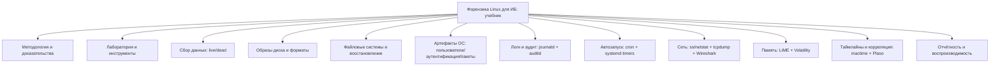
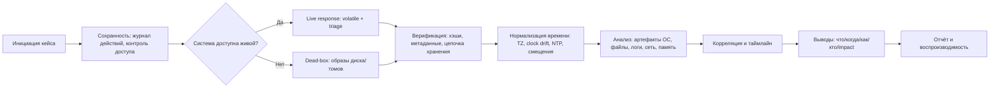

# Модульное учебное пособие по форензике Linux для ИБ: план и содержание, готовое к разработке

## Executive summary

Это пособие проектируется как практико-ориентированный учебник по форензике Linux для задач информационной безопасности (DFIR/IR), с опорой на воспроизводимые процедуры: сохранность доказательств, сбор данных (live response и «dead-box»), анализ файловых систем и артефактов ОС, расследование процессов и автозапуска (cron/systemd), журналирование (systemd-journald/journalctl, auditd), сетевой анализ (ss/netstat, tcpdump, Wireshark/TShark), таймлайны (Sleuth Kit/mactime и Plaso), а также анализ памяти (LiME + Volatility). Методологический «каркас» выстроен вокруг признанных подходов к форензике в реагировании на инциденты (NIST SP 800-86) и обращения с цифровыми доказательствами (ISO/IEC 27037; ACPO GPG v5). citeturn0search0turn0search5turn0search2

В отличие от «курса с домашними заданиями», структура ниже сознательно **не включает упражнения для самостоятельного решения** (по вашему уточнению). Вместо этого каждый модуль включает цель, ключевую теорию, пошаговые практические процедуры с примерами команд и «ожидаемыми» (иллюстративными) выводами, типовые ловушки/анти‑паттерны и ссылочную базу (официальные документы инструментов, первоисточники, авторитетные русскоязычные материалы). Разделы, требующие уточнения под вашу инфраструктуру (тип дистрибутивов, источники образов/дампов, юридическая юрисдикция, требования к отчётности), отмечены как **неуточнено**.



## Предварительные требования, целевая аудитория и безопасность

**Целевая аудитория.** Пособие рассчитано на специалистов ИБ и смежных ролей: аналитиков SOC/CSIRT, специалистов по реагированию на инциденты, инженеров безопасности Linux, «blue team», внутренних расследователей, а также DevOps/SRE, которым нужно проводить технически корректные расследования на Linux-хостах (**неуточнено**, требуется ли упор на корпоративные стандарты отчётности/комплаенс). Подход и терминология согласуются с тем, что NIST описывает форензику как практическую составляющую реагирования на инциденты, включающую сбор, исследование и анализ данных из разных источников (файлы, ОС, сеть, приложения). citeturn0search0

**Предварительные требования к знаниям.**  
Требуется уверенное администрирование Linux на уровне: файловые права и владение, процессы, systemd, сетевые основы, базовые навыки bash и потоковой обработки текста. Для модулей по памяти — понимание адресных пространств и базовых понятий ядра (**неуточнено**, нужен ли уровень «kernel internals»).

**Безопасность и этика.**  
Пособие предполагает работу в рамках законного полномочия и внутренней политики. Практики должны обеспечивать «судебную пригодность» (forensic soundness) и управление риском изменения данных. ISO/IEC 27037 формализует действия обращения с цифровыми доказательствами как идентификацию, сбор/изъятие, получение (acquisition) и сохранение (preservation). citeturn0search5  
ACPO Good Practice Guide v5 закрепляет принципы обращения с цифровыми доказательствами (в индустрии часто используется как ориентир «лучшей практики»). citeturn0search2  
Отдельно подчёркивается: любые действия на «живой» системе (включая чтение /proc, запуск утилит, выгрузку памяти, сбор сетевого дампа) изменяют состояние системы; задача — минимизировать и документировать вмешательство по процедурам, согласованным с NIST‑подходом к форензике в IR. citeturn0search0turn7search2

## Лаборатория, оборудование и виртуальные стенды

**Рекомендуемая лабораторная топология.**  
Минимально: (1) «аналитическая» машина/VM, (2) «исследуемая» VM (жертва) + (3) отдельное хранилище/том под доказательства (read-only где возможно). Для сетевых сценариев — виртуальный сегмент/виртуальный свитч.

**Базовый набор сред/дистрибутивов.**  
В качестве готовой форензик‑среды уместно использовать SIFT Workstation (SANS) как комплект FOSS‑инструментов для DFIR, распространяемый как OVA (актуальность обновлений важна для воспроизводимости лабораторных работ). На странице SANS SIFT прямо описан как «collection of free and open-source incident response and forensic tools». citeturn8search0turn8search4

**Источники учебных данных и «чистые» датасеты.**  
Чтобы избегать проблем с персональными данными и лицензиями, опирайтесь на публичные наборы:
- NIST CFReDS — «documented sets of simulated digital evidence» для практики и тестирования инструментов. citeturn14search6turn14search2  
- Digital Corpora (в т.ч. NPS Test Disk Images): наборы образов для обучения/тестирования; отдельно отмечается отсутствие непубличных PII и разрешённость к публикации. citeturn14search0  
- Публичные «memory samples» для Volatility (хоть страница и в архивном репозитории, это всё ещё полезный каталог ссылок на датасеты). citeturn14search3

**Рекомендуемое оборудование.**  
Типовой комфортный минимум для аналитической VM: 8 vCPU, 32–64 ГБ RAM, SSD и отдельный диск/том под образы (1–2 ТБ). Для модулей памяти — RAM на аналитической стороне желательно ≥ объёма анализируемых дампов. Значения — ориентиры; точные требования зависят от размера образов и числа параллельных кейсов (**неуточнено**).

## Методология расследования и типовые рабочие процессы

Ниже — «сквозной» процесс, который затем раскладывается на модули. Он согласован с тем, что NIST SP 800‑86 описывает форензик‑процесс как последовательность работ по сбору, исследованию и анализу данных в рамках IR‑контекста. citeturn0search0



**Ключевой принцип «воспроизводимых действий».**  
Любая команда, влияющая на доказательства, должна быть:
- минимально инвазивной (по возможности чтение вместо записи),
- документированной (кто/когда/где/чем),
- проверяемой (контроль целостности, хэши, сравнение результатов инструментов),
- повторяемой на копии (анализ всегда на копии, оригинал — под сохранностью).

**Работа с журналами systemd-journald.**  
`systemd-journald` — сервис, который собирает структурированные журнальные данные из разных источников (kernel log, syslog API, native journal API, stdout/stderr юнитов). citeturn0search7  
`journalctl` — основной инструмент запросов к журналу: фильтрация по полям вида `FIELD=VALUE` и по диапазону времени. citeturn0search3turn9search17  
Полезно учитывать, что записи журнала «похожи на environment block», могут содержать бинарные значения и неуникальные имена полей. citeturn9search1  
Для экспорта возможны форматы, описанные systemd как «simple serialization… easy to read… but still binary safe». citeturn12search1

**Работа с аудитом Linux auditd.**  
`auditd` — userspace‑компонент Linux Auditing System, пишет audit‑записи на диск; просмотр — `ausearch`/`aureport`, конфигурация — `auditctl`. citeturn2search2  
`aureport` формирует сводные отчёты и позволяет затем найти «полное событие» через `ausearch -a`. citeturn9search2  
Формат audit‑ивентов включает записи типа `PATH` на каждый путь, переданный системному вызову, и полезные поля вроде `cwd`. citeturn12search2  
Есть и качественные русскоязычные объяснения структуры audit‑логов в документации ALT Linux (включая смысл связки `msg=audit(time_stamp:ID)` и группировку нескольких записей в одно событие). citeturn12search6turn2search10

## Модульный план и содержание учебного пособия

Ниже приведены модули как «строительные блоки» учебника. Каждый модуль содержит: цель, теорию (концепции), практическую процедуру с командами и иллюстративными выводами, типовые ловушки, рекомендуемые источники.  
Уровни сложности: **B** (базовый), **I** (средний), **A** (продвинутый). Длительности указаны для очного/самостоятельного прохождения с демонстрациями (**неуточнено**, какой формат подачи предпочитаете).

### Сводная карта модулей

| Модуль | Тема | Сложность | Время | Основные инструменты |
|---|---|---:|---:|---|
| M1 | Методология DFIR, доказательства, chain of custody | B | 3–4 ч | базовые утилиты, хэширование |
| M2 | Лаборатория и набор инструментов | B | 2–3 ч | SIFT, Autopsy/TSK, Wireshark, Plaso |
| M3 | Live response: процессы, /proc, открытые файлы, сеть | I | 6–8 ч | ps/ss/lsof, systemd, journalctl |
| M4 | Сбор и упаковка данных: dd, rsync, EWF/AFF4 | I | 6–8 ч | dd, rsync, ewfacquire, хэши |
| M5 | Разделы, файловые системы и Sleuth Kit | I | 8–10 ч | mmls/fls/istat/icat/mactime, Autopsy |
| M6 | Артефакты ОС: пользователи, SSH, sudo, пакеты | I | 6–8 ч | grep/awk/sed, journalctl, last |
| M7 | Логи и аудит: journald + auditd, экспорт и корреляция | A | 8–10 ч | journalctl, ausearch/aureport, Plaso |
| M8 | Persistence: cron и systemd timers/units | I | 6–8 ч | crontab, systemctl, systemd.timer |
| M9 | Сетевые расследования: PCAP/PCAPNG, tcpdump, Wireshark | I | 8–10 ч | tcpdump, tshark, Wireshark, ss |
| M10 | Память: LiME и Volatility, поиск скрытых артефактов | A | 10–12 ч | LiME, Volatility 3, корреляция |

---

### M1 — Методология DFIR и обращение с цифровыми доказательствами

**Цель обучения.**  
Сформировать «форензик‑мышление»: как работать так, чтобы результаты расследования были проверяемыми, объяснимыми и (при необходимости) пригодными для формального разбирательства.

**Теория: ключевые концепции.**  
NIST SP 800‑86 позиционирует форензику как практический набор техник, интегрируемых в инцидент‑респонс (сбор/исследование/анализ). citeturn0search0  
ISO/IEC 27037 определяет рамку обращения с цифровыми доказательствами: идентификация, сбор/изъятие, acquisition и preservation потенциальных цифровых доказательств. citeturn0search5  
ACPO GPG v5 — индустриальный ориентир по «good practice» обращения с цифровыми доказательствами. citeturn0search2

Ключевые элементы, которые учебник будет повторять во всех модулях:
- разделение на **оригинал / рабочую копию / производные артефакты**;
- контроль целостности (хэши на каждом переходе состояния);
- минимизация изменения источника;
- журналирование действий аналитика (операторский «logbook»).

**Практика: базовая «обвязка кейса».**  
Шаблон структуры кейса (пример):

```bash
CASE=IR-2026-02-12-host42
mkdir -p "$CASE"/{00_intake,10_acquisition,20_working,30_exports,40_reports,90_logs}
date -Is | tee -a "$CASE/90_logs/analyst_log.txt"
uname -a | tee -a "$CASE/90_logs/analyst_log.txt"
```

Идея: фиксировать контекст и время до начала работы (особенно важно перед live response).

**Контроль целостности (хэши) — минимальный стандарт.**  
(Вывод ниже иллюстративный.)

```bash
sha256sum disk.img | tee disk.img.sha256
# 9c7f...  disk.img
```

**Типовые ловушки.**  
Самая частая ошибка — «потрогать прод» без логирования команд и таймстемпов, а затем пытаться восстановить цепочку событий задним числом; второй класс ошибок — смешивание оригиналов и рабочих копий.

**Рекомендуемые источники.**  
NIST SP 800‑86. citeturn0search0  
ISO/IEC 27037:2012 (описание стандарта и его scope). citeturn0search1turn0search5  
ACPO Good Practice Guide for Digital Evidence v5 (PDF). citeturn0search2

---

### M2 — Лаборатория и инструментальная база расследований Linux

**Цель обучения.**  
Собрать воспроизводимую лабораторию и понимать назначение ключевых инструментов (CLI и GUI) до начала «боевого» анализа.

**Теория: ключевые концепции.**  
Практика форензики почти всегда требует **разделения ролей**: (а) среда анализа, (б) данные (образы/дампы), (в) инструменты и их версии (важно для повторяемости и сопоставимости результатов).

**Практика: эталонная лаборатория на SIFT.**  
SIFT Workstation описывается как набор FOSS‑инструментов для IR и форензики и доступен как OVA (удобно фиксировать версию VM как baseline лаборатории). citeturn8search0

Рекомендуемая минимальная процедура «паспортирования» лаборатории:

```bash
# Сохранить сведения о среде анализа
date -Is
lsb_release -a 2>/dev/null || cat /etc/os-release
python3 --version
which log2timeline.py psort.py vol.py 2>/dev/null
wireshark --version 2>/dev/null
```

**Наборы учебных данных (рекомендуемые).**  
Для дисков — NIST CFReDS и Digital Corpora; для памяти — каталоги memory samples. citeturn14search6turn14search0turn14search3

**Типовые ловушки.**  
Не фиксировать версии инструментов и форматы входных данных (raw/E01/AFF4/qcow2/pcapng) — прямой путь к «не воспроизводится у другого аналитика».

**Рекомендуемые источники.**  
SIFT Workstation (SANS). citeturn8search0  
NIST CFReDS portal и описание проекта. citeturn14search2turn14search6  
Digital Corpora Disk Images (обоснования по PII/релизу). citeturn14search0

---

### M3 — Live response на Linux: расследование процессов, /proc, открытых файлов и сети

**Цель обучения.**  
Научиться собирать «летучие» и быстро изменяемые данные (процессы, соединения, состояние служб, актуальные логи), минимизируя вмешательство и документируя изменения.

**Теория: ключевые концепции.**  
`/proc` — псевдо‑ФС, интерфейс к структурам ядра, обычно смонтирован в `/proc`. citeturn7search2  
Важно понимать: чтение `/proc` отражает текущее состояние; это не «журнал», и данные исчезают при завершении процессов.

Для systemd‑систем полезно видеть иерархию cgroup: `systemd-cgls` показывает дерево control groups и процессы внутри. citeturn11search0

**Практика: минимальный «снимок состояния» (triage pack).**  
Пример: собрать снимки так, чтобы потом можно было воспроизвести ход мыслей.

```bash
OUT=triage_$(hostname)_$(date -u +%Y%m%dT%H%M%SZ)
mkdir -p "$OUT"

# 1) Время и контекст
date -Is | tee "$OUT/time_local.txt"
date -u -Is | tee "$OUT/time_utc.txt"
uptime | tee "$OUT/uptime.txt"

# 2) Процессы и cgroup/systemd
ps auxwwf > "$OUT/ps_auxwwf.txt"
systemd-cgls --no-pager > "$OUT/systemd-cgls.txt"

# 3) Сокеты (предпочтительно ss)
ss -tulpen > "$OUT/ss_tulpen.txt"
ss -tanp > "$OUT/ss_tanp.txt"
```

`ss` — штатный инструмент iproute2 для «socket statistics». citeturn2search3  
Если в организации ещё используют `netstat`, важно понимать, что многие дистрибутивы считают `netstat` (пакет net-tools) устаревшим и документируют переход на `iproute2`/`ss` (например, ArchWiki прямо пишет, что `ss` имеет схожий функционал с «устаревшей netstat»). citeturn10search3turn10search1turn10search2

**Открытые файлы и привязка «процесс ↔ файл/сокет».**  
`lsof` в отсутствие опций перечисляет все открытые файлы всех активных процессов — это полезно для связывания «подозрительный PID → бинарник/конфиги/сокеты». citeturn11search2

```bash
lsof -nP > "$OUT/lsof_all.txt"
lsof -nP -iTCP -sTCP:LISTEN > "$OUT/lsof_listen.txt"
```

**Быстрый сбор релевантных логов systemd-journald.**  
`journalctl` печатает записи из systemd‑журнала и поддерживает фильтрацию по полям и времени. citeturn0search3turn9search17

```bash
# последние 2 часа по SSH (имя юнита зависит от дистрибутива: ssh.service/sshd.service — неуточнено)
journalctl -u ssh.service --since "2 hours ago" --no-pager > "$OUT/journal_ssh_last2h.txt"
journalctl -u sshd.service --since "2 hours ago" --no-pager > "$OUT/journal_sshd_last2h.txt"
```

Иллюстративный фрагмент ожидаемого вывода:

```text
Feb 12 10:14:03 host42 sshd[2173]: Accepted publickey for devops from 203.0.113.10 port 51544 ssh2
Feb 12 10:14:07 host42 sshd[2179]: pam_unix(sshd:session): session opened for user devops(uid=1001)
```

**Типовые ловушки.**  
Сбор «всего подряд» без гипотез и без фиксации времени запуска команд. Второй системный риск — запуск тяжёлых сканеров на боевом сервере во время инцидента (нагрузка, изменение кешей, ротация логов).  

**Рекомендуемые источники.**  
`/proc` (man proc(5)). citeturn7search2  
`systemd-cgls` (man). citeturn11search0  
`journalctl` (man). citeturn0search3  
`ss` (man). citeturn2search3

---

### M4 — Сбор данных и создание копий: dd, rsync, форматы образов EWF/AFF4

**Цель обучения.**  
Уметь получать и проверять копии данных (диски/тома/каталоги) аккуратно, понимая ограничения форматов и инструментов.

**Теория: ключевые концепции.**  
1) **Поблочное копирование (disk imaging)** vs **файловая копия**. Поблочный образ нужен для анализа разделов, незанятого пространства и восстановления удалённого.  
2) **Обработка ошибок чтения.** В GNU coreutils описано, что `dd conv=noerror,sync` позволяет продолжать после ошибок чтения и дополнять «плохие» блоки нулями; `iflag=fullblock` помогает корректно обрабатывать короткие чтения (актуально в некоторых сценариях). citeturn2search0  
3) **Rsync и сохранение атрибутов.** `rsync` широко используется для бэкапов/зеркалирования; по умолчанию применяет «quick check» по размеру и времени модификации для определения изменившихся файлов. citeturn2search1  
4) **Форматы образов.**  
   - EWF/E01 — распространённый форензик‑формат, документируемый в libewf; исторически используется в проприетарных инструментах (EnCase/FTK), поддерживает контейнеризацию/метаданные/сегментацию. citeturn6search0turn6search4  
   - AFF4 — открытый «framework» для хранения цифровых доказательств; есть стандартные документы (AFF4 Standard) и классическая публикация в Digital Investigation (2009) в библиографиях проекта. citeturn6search13turn6search1turn6search9

**Практика: поблочный образ dd с контрольными точками.**  
(Команды — пример; устройство и путь уточняются под стенд.)

```bash
# 0) Идентифицировать устройство (неуточнено: конкретная команда инвентаризации)
lsblk -o NAME,SIZE,MODEL,SERIAL,TYPE,MOUNTPOINT

# 1) Снять образ (пример: /dev/sdb -> evidence/disk.raw)
sudo dd if=/dev/sdb of=./disk.raw bs=4M iflag=fullblock \
  conv=noerror,sync status=progress
```

GNU документация указывает, что dd обычно печатает статистику копирования, а параметры `conv=noerror,sync` и `iflag=fullblock` применяются как «rescue method» при ошибках чтения. citeturn2search0turn2search4

Иллюстративный вывод dd:

```text
7287+1 records in
7287+1 records out
30513500160 bytes (31 GB) copied, 512.12 s, 59.6 MB/s
```

Далее — хэши:

```bash
sha256sum disk.raw | tee disk.raw.sha256
```

**Практика: файловый сбор rsync (например, triage-экспорт).**  
Режим `--archive` (обычно `-a`) сохраняет права/владение/симлинки и т.д. (это описано в man‑страницах rsync как «archive mode»). citeturn2search9turn2search1

```bash
sudo rsync -aHAX --numeric-ids --inplace --info=progress2 \
  /suspect_mount/  ./logical_copy/
```

**Практика: EWF через ewf-tools (когда нужен E01).**  
Libewf в Kali‑описании позиционируется как библиотека и набор инструментов для чтения/записи EWF (включая SMART S01 и EnCase E01). citeturn6search4turn6search0  
(Конкретные ключи/политики сегментации — **неуточнено** в вашей среде.)

**Типовые ловушки.**  
- Использовать rsync там, где требуется поблочный образ (теряется незанятое пространство и часть следов удаления).  
- Снимать образ на тот же диск/том, что и источник.  
- Не фиксировать «какой именно /dev/sdX» копировали (путают диски).

**Рекомендуемые источники.**  
GNU coreutils dd invocation. citeturn2search0  
man rsync(1). citeturn2search1  
libewf: спецификация EWF и описание инструментов. citeturn6search0turn6search4  
AFF4 Standard и описание формата. citeturn6search13turn6search9turn6search1

---

### M5 — Анализ разделов и файловых систем: Sleuth Kit и Autopsy

**Цель обучения.**  
Уметь анализировать «volume system» (разделы), файловые системы и извлекать артефакты (включая удалённые файлы и таймлайны) воспроизводимыми инструментами.

**Теория: ключевые концепции.**  
The Sleuth Kit (TSK) — набор CLI‑утилит и библиотека для анализа дисков и файловых систем; он специально предназначен для исследования «disk images» и анализа volume/file system данных. citeturn14search13turn6search11turn6search3  
`mmls` отображает layout разделов (partition tables / disk labels). citeturn13search1turn13search9  
`fls` перечисляет имена файлов/директорий в образе и может показывать недавно удалённые файлы. citeturn9search15turn9search3  
`icat` извлекает содержимое файла по inode (metadata address), копируя в stdout. citeturn13search2  
Таймлайн `mactime` строится по bodyfile (обычно из `fls -m`) и помогает реконструировать последовательность событий (MACB‑времена). citeturn1search4turn1search0

Для ext4 полезно опираться на kernel docs, которые позиционируются как «canonical source of information» по on-disk артефактам, а также понимать роль journal (jbd2) в защите метаданных от несогласованности при сбое. citeturn7search3turn7search15

**Практика: разметка → файловая система → извлечение файла.**

1) Найти разделы:

```bash
mmls disk.raw
```

Иллюстративный вывод (упрощённо):

```text
Slot    Start       End         Length      Description
00:00   0000000000  0000002047  2048        Primary Table (#0)
00:01   0000002048  0629144575  629142528   Linux (0x83)
```

TSK‑документация подчёркивает, что `mmls` используется, чтобы определить начало разделов; это упрощает извлечение раздела через `dd` по смещению. citeturn13search9

2) Извлечь раздел (если нужно выделить конкретный partition в отдельный образ):

```bash
# пример: старт 2048 секторов, сектор 512 байт
dd if=disk.raw of=part1.raw bs=512 skip=2048 count=629142528 status=progress
```

3) Просмотреть корень ФС через TSK:

```bash
# -o задаёт offset в секторах (если анализируем общий образ), пример:
fls -o 2048 disk.raw
```

4) Найти inode и извлечь файл:

```bash
# допустим, нашли inode=12345
icat -o 2048 disk.raw 12345 > extracted_file.bin
```

`icat` по спецификации «copies the file with the specified inode number to standard output». citeturn13search2

5) Построить таймлайн через mactime:

```bash
fls -o 2048 -m / -r disk.raw > bodyfile.txt
mactime -b bodyfile.txt > timeline.csv
```

**Autopsy как GUI‑обвязка вокруг TSK.**  
Autopsy имеет «ingest modules», которые анализируют данные источника (hash lookup, keyword search и т.п.). citeturn13search12  
У Autopsy есть функциональность Timeline, документированная в официальном user guide. citeturn1search1

**Типовые ловушки.**  
- Перепутать единицы смещения (сектора vs байты) при `-o`/`dd skip`.  
- Смешать GPT/MBR/дисковые метаданные и принять «unallocated» за «пусто» (TSK показывает невыделенные промежутки явно). citeturn13search5

**Рекомендуемые источники.**  
TSK overview. citeturn14search13  
mmls/fls/icat/mactime man pages и wiki. citeturn13search1turn9search15turn13search2turn1search0  
Autopsy docs (Ingest, Timeline). citeturn13search12turn1search1  
Linux kernel docs по ext4 и journaling. citeturn7search3turn7search15

---

### M6 — Артефакты ОС Linux: пользователи, аутентификация, SSH/sudo, пакеты

**Цель обучения.**  
Уметь отвечать на вопросы «кто заходил?», «что запускал?», «что менялось?» на основе типовых артефактов Linux, в том числе при частичном отсутствии логов.

**Теория: ключевые концепции.**  
- События входа/выхода часто отражаются в wtmp‑подобных журналах; `last` читает wtmp и показывает, в т.ч., события reboot/shutdown как специальные пользователи. citeturn11search3  
- На systemd‑хостах существенную часть следов даёт journald; `journalctl` позволяет фильтровать по unit и полям. citeturn0search3turn9search17  
- Для разбора текстовых артефактов основа — `grep` (BRE/ERE/PCRE режимы), `awk` (поля и разделители), `sed` (потоковый редактор). citeturn4search2turn4search3turn5search3

**Практика: расследование «подозрительный SSH‑доступ».**  
(Имена юнитов и расположение классических логов зависят от дистрибутива: `/var/log/auth.log` vs `/var/log/secure` — **неуточнено**.)

1) Срез по journald:

```bash
journalctl -u sshd.service --since "2026-02-12 00:00:00" --no-pager > sshd_day.txt
grep -E "Accepted|Failed password|Invalid user" sshd_day.txt | head
```

`grep` поддерживает extended regex через `-E`. citeturn4search2

2) Быстрая агрегация источников по IP через awk (иллюстративно):

```bash
grep "Accepted" sshd_day.txt \
 | awk '{print $(NF-3)}' \
 | sed 's/from//' \
 | sort | uniq -c | sort -nr | head
```

`awk` концептуально выделяет поля на основе разделителя (символ или regex). citeturn4search3  
`sed` — потоковый редактор для преобразований в пайплайне. citeturn5search3

3) Проверка логинов/ребутов через `last`:

```bash
last -a | head -50
last reboot | head
```

`last reboot` выводит записи перезагрузок. citeturn11search3

4) (Опционально) На Debian‑подобных системах можно дополнительно смотреть «следы управления пакетами» через dpkg (как ещё один источник «что менялось на системе»). `dpkg` описывается как «medium-level tool to install… manage Debian packages». citeturn12search0  
Русская версия Debian Handbook поясняет роль dpkg как базовой команды управления пакетами. citeturn12search4  
(Конкретный формат `/var/log/dpkg.log` и процедуры анализа — **неуточнено** под ваши дистрибутивы и политику логирования.)

**Типовые ловушки.**  
- Игнорировать нормализацию времени (UTC vs localtime; возможен clock drift).  
- Делать вывод «события не было», если journald настроен на volatile storage или журналы уже ротированы (**неуточнено**, политика journald). `journald.conf` описывает, где и как настраивается экземпляр systemd-journald. citeturn12search13

**Рекомендуемые источники.**  
`journalctl` и поля journald. citeturn0search3turn9search1  
GNU grep manual / man grep. citeturn4search6turn4search2  
GNU awk (field separators). citeturn4search3  
GNU sed manual. citeturn5search3  
man last(1). citeturn11search3  
man dpkg(1) и Debian Handbook RU. citeturn12search0turn12search4

---

### M7 — Журналы и аудит: journald/journalctl, auditd, экспорт, корреляция, Plaso

**Цель обучения.**  
Построить «надёжную» линию событий: от низкоуровневых журналов (audit) до сервисных (journald) и высокоуровневой корреляции (таймлайны).

**Теория: systemd-journald**  
`systemd-journald` собирает логи из нескольких источников и хранит их структурированно и индексировано. citeturn0search7  
`journalctl` поддерживает фильтрацию по полям `FIELD=VALUE` и интервалам времени. citeturn0search3turn9search17  
Семантика полей и возможность бинарных значений описаны в `systemd.journal-fields`. citeturn9search1  
Экспортный формат journald описан как простая сериализация, «easy to read… but still binary safe». citeturn12search1

**Теория: Linux Audit (auditd)**  
`auditd` отвечает за запись audit‑логов, просмотр — `ausearch`/`aureport`, настройка — `auditctl`. citeturn2search2  
`ausearch` — инструмент запросов к audit‑логам по критериям, опции соединяются логическим AND. citeturn9search14  
`aureport` производит сводные отчёты; события можно «раскрывать» через `ausearch -a`. citeturn9search2  
Документация Red Hat объясняет структуру audit‑событий (включая PATH‑records на каждый путь и поля `cwd`). citeturn12search2  
Русскоязычные материалы ALT Linux полезны для понимания идентификатора `audit(time_stamp:ID)` и группировки записей одного события. citeturn12search6

**Теория: таймлайны и Plaso**  
Plaso (log2timeline/psort) предназначен для извлечения событий из файлов/каталогов/образов и формирования «storage file», который затем анализируется `psort`/`pinfo`. Это прямо указано в User’s Guide: `log2timeline` создаёт plaso storage file, который анализируется `pinfo` и `psort`. citeturn1search7turn1search15  
`psort` описан как инструмент пост‑обработки storage files: фильтрация, сортировка, автоматический анализ. citeturn1search3

**Практика: journald — точечный поиск по полям и экспорт.**

```bash
# Поиск по unit + диапазон времени
journalctl _SYSTEMD_UNIT=sshd.service --since "2026-02-12 00:00:00" --until "2026-02-12 06:00:00" --no-pager

# Экспорт в JSON (удобно для дальнейшего парсинга)
journalctl -u sshd.service --since "today" -o json > sshd.json
```

Список «well-known fields» и семантика фильтров упоминаются в man journalctl. citeturn9search17turn9search1

**Практика: auditd — поиск событий и отчёты.**

```bash
# Поиск по ключу правил audit (пример; зависит от того, как настроены правила — неуточнено)
ausearch -k exec_monitor --start today

# Отчёт по исполняемым событиям (пример из практики Red Hat)
aureport -x
```

Примерная связка «aureport → event id → ausearch -a» следует из описания aureport. citeturn9search2

**Практика: Plaso — построение «супер‑таймлайна» из каталога монтирования.**

```bash
# 1) Извлечение событий
log2timeline.py plaso.dump /mnt/evidence_mount

# 2) Выгрузка в CSV с фильтрами (пример)
psort.py -o l2tcsv -w timeline.csv plaso.dump
```

Что `log2timeline` рекурсивно обходит каталог/образ и формирует storage file — прямо указано в документации Plaso. citeturn1search7turn1search15

**Типовые ловушки.**  
- Путать «время события» (event time) и «время записи» (ingest/log write time).  
- Игнорировать особенности journald (возможны бинарные поля, неоднозначные имена, разные namespaces). citeturn9search1turn12search13

**Рекомендуемые источники.**  
systemd‑journald, journalctl, systemd.journal-fields, JOURNAL_EXPORT_FORMATS. citeturn0search7turn0search3turn9search1turn12search1  
auditd/ausearch/aureport man pages; Red Hat Security Guide по audit logs; ALT Linux docs (RU). citeturn2search2turn9search14turn9search2turn12search2turn12search6  
Plaso User’s Guide / psort docs. citeturn1search7turn1search3

---

### M8 — Persistence и автозапуск: cron и systemd timers/units

**Цель обучения.**  
Системно находить механизмы закрепления (persistence) на Linux: cron‑задачи, systemd‑таймеры, сервисы, пользовательские автозапуски.

**Теория: cron.**  
`crontab` — программа для установки/удаления/просмотра таблиц cron; у каждого пользователя может быть свой crontab, и хотя файлы лежат в `/var/spool/cron/crontabs`, они «not intended to be edited directly». citeturn3search0turn3search20  
Для системных периодических задач также используются директории `/etc/cron.hourly` и т.п. (в Debian‑подобных системах это следует из настроек `/etc/crontab` и `run-parts`). citeturn3search4

**Теория: systemd timers.**  
`.timer`‑юнит кодирует параметры таймера, управляемого systemd; опции задаются в секции `[Timer]`. citeturn3search1  
ArchWiki указывает, что спецификации `OnCalendar` можно тестировать и проверять валидность расписания. citeturn3search21  
В русскоязычной документации Astra Linux подчёркивается роль `AccuracySec` как «разброса» времени запуска (снижение пиков), что полезно при анализе регулярных задач и «джиттера». citeturn3search17

**Практика: поиск cron‑закрепления.**

```bash
# Пользовательские таблицы
crontab -l
sudo crontab -l -u root

# Системные директории периодических заданий
ls -la /etc/cron.* /etc/cron.d 2>/dev/null
```

**Практика: поиск systemd‑таймеров и сервисов.**

```bash
# Список активных таймеров
systemctl list-timers --all --no-pager

# Какие юниты включены на автозапуск
systemctl list-unit-files --state=enabled --no-pager | head

# Посмотреть свойства подозрительного юнита (machine-readable)
systemctl show suspicious.service --no-pager
```

`systemctl` умеет перечислять юниты, загруженные systemd, и их свойства. citeturn11search1turn11search5

**Типовые ловушки.**  
- Искать только cron и забывать о systemd timers (в современных системах их часто используют вместо cron).  
- Не проверять «владельца» и права на файлы в `/etc/cron.d` и unit‑файлах (тема прав/ACL — **неуточнено**, если нужна углублённая часть).

**Рекомендуемые источники.**  
man crontab(1), cron(8). citeturn3search0turn3search4  
man systemd.timer(5), ArchWiki systemd/Timers, Astra Linux wiki. citeturn3search1turn3search21turn3search17  
man systemctl(1). citeturn11search1

---

### M9 — Сетевые расследования: ss/netstat, tcpdump, Wireshark, форматы PCAP/PCAPNG

**Цель обучения.**  
Научиться собирать и анализировать сетевые артефакты: сокеты/порты/процессы, дампы трафика и их фильтрацию/интерпретацию.

**Теория: сокеты и ss.**  
`ss` предназначен для вывода socket statistics (часто используется вместо netstat). citeturn2search3  
Документированные переходы от legacy net-tools к iproute2 встречаются в Ubuntu и Debian‑материалах; Debian Wiki прямо рассматривает «NetToolsDeprecation», а Ubuntu — спецификацию «DeprecateLegacyNetToolsSpec». citeturn10search2turn10search1  
Русский ArchWiki прямо отмечает, что `ss` используется для информации о сокетах и имеет схожий функционал со «считающейся устаревшей netstat». citeturn10search3

**Теория: захват трафика и фильтры.**  
Wireshark различает capture filters и display filters; capture filters задаются до старта и не меняются на лету, display filters — можно менять. citeturn3search3  
`pcap` формат описан в IETF Internet-Draft как формат, используемый libpcap для записи захваченных пакетов; такие файлы читают/пишут программы на libpcap, включая tcpdump. citeturn5search6  
`pcapng` описывается как расширяемый формат; Wireshark его читает/пишет, libpcap — читает некоторые файлы. citeturn5search5  
Wireshark Wiki также подчёркивает, что libpcap формат — основной формат tcpdump и многих систем, и что Wireshark/TShark его поддерживают, но по умолчанию генерируют pcapng. citeturn5search2

**Практика: первичный снимок сети на хосте.**

```bash
ss -tulpen
ss -tanp
ip route 2>/dev/null
```

**Практика: tcpdump — захват на файл для последующего анализа.**

```bash
# Захват на всех интерфейсах (если поддерживается) и запись в файл
sudo tcpdump -i any -nn -s0 -w capture.pcapng
```

Примеры опций и общий принцип `-w`/`-r` для tcpdump описываются в man‑страницах tcpdump (сохранение в файл и чтение из файла). citeturn5search4turn5search8  
Синтаксис Berkeley Packet Filter (BPF) фиксируется в описаниях pcap-filter. citeturn3search6

**Практика: TShark/Wireshark — чтение и display filters.**  
TShark man page поясняет, что если указан `-r` (чтение файла), то фильтр после опций интерпретируется как display filter; `-w` при чтении/захвате пишет в файл и не печатает пакеты в stdout. citeturn4search1

```bash
# Читать дамп и отфильтровать HTTP запросы (пример display filter)
tshark -r capture.pcapng -Y "http.request" -T fields -e frame.time -e ip.src -e http.host -e http.request.uri | head
```

**Типовые ловушки.**  
- Путать BPF (capture filter) и Wireshark display filter. citeturn3search3turn4search1  
- Делать выводы по одному источнику (например, только по pcaps), не связывая с `ss`/процессами и логами.

**Рекомендуемые источники.**  
Wireshark User’s Guide (PDF) и Wireshark Wiki (capture filters, file formats). citeturn3search19turn3search3turn5search2  
IETF drafts: PCAP и PCAPNG. citeturn5search6turn5search5  
man tshark. citeturn4search1  
man tcpdump, pcap-filter. citeturn5search8turn3search6

---

### M10 — Форензика памяти на Linux: LiME и Volatility

**Цель обучения.**  
Понимать ценность и ограничения volatile memory, уметь получить дамп и извлечь артефакты (процессы, аргументы командной строки и др.) средствами Volatility.

**Теория: почему память важна.**  
Исторически исследования volatile memory forensics развивались как отдельная дисциплина; в статье FATKit (Digital Investigation, 2007) описывается модульный framework для извлечения и анализа цифровых артефактов из volatile system memory, снижая «ручную» тяжесть низкоуровневого извлечения. citeturn8search5turn8search1  
В практическом DFIR это важно для обнаружения fileless‑активности, краткоживущих процессов и контекстов, которых нет на диске (**конкретные «что именно ищем» — зависит от угрозмодели, неуточнено**).

**Теория: получение памяти LiME.**  
LiME — Loadable Kernel Module для получения volatile memory с Linux/Android; README даёт точный синтаксис insmod и указывает поддерживаемые форматы `raw|padded|lime` и опциональную генерацию digest. citeturn7search0turn7search4

**Практика: выгрузка памяти LiME.**  
(Сбор памяти — вмешательство в систему; это должно быть согласовано с политикой расследования.)

```bash
# пример: выгрузка в файл в формате lime
sudo insmod lime.ko "path=/evidence/ram.lime format=lime digest=sha256"
```

Синтаксис параметров `path=... format=... [digest=...]` соответствует документации LiME. citeturn7search0

**Теория и практика: анализ Volatility 3.**  
Volatility 3 документирует плагины для Linux. Например, `volatility3.plugins.linux.pslist` «Lists the processes present in a particular linux memory image». citeturn1search2  
А `linux.psaux` «Lists processes with their command line arguments». citeturn13search11

Пример запуска (пути и символы ядра — **неуточнено** и зависят от дампа/версии ядра):

```bash
python3 vol.py -f ram.lime linux.pslist.PsList
python3 vol.py -f ram.lime linux.psaux.PsAux
```

Иллюстративный фрагмент вывода pslist:

```text
PID   PPID  COMM
1     0     systemd
742   1     sshd
2179  742   sshd
```

**Типовые ловушки.**  
- Несоответствие символов ядра (Volatility для Linux часто требует корректных символов/профиля; в практических кейсах это основной источник ошибок — **неуточнено**, как вы планируете обеспечивать символы).  
- Взятие дампа «после» перезапуска/убийства процессов.

**Рекомендуемые источники.**  
LiME GitHub (usage, форматы). citeturn7search0turn7search4  
Volatility 3 docs по linux.pslist и linux.psaux. citeturn1search2turn13search11  
FATKit paper (как первоисточник по framework‑подходу к volatile memory forensics). citeturn8search5turn8search1

---

### Сквозные учебные сценарии (case studies) с пошаговым решением

Сценарии ниже — «витрина» того, как модули связываются в целостное расследование. Данные можно брать из публичных датасетов (CFReDS/Digital Corpora/публичные memory samples). citeturn14search6turn14search0turn14search3

**Case A: «Майнер/бот закрепился через systemd timer + обратное соединение»**  
1) Live response: `ps auxwwf`, `systemd-cgls`, `ss -tanp`, `lsof -iTCP`. citeturn11search0turn2search3turn11search2  
2) Поиск таймеров: `systemctl list-timers --all`; выявить подозрительный `.timer`/`.service` (OnCalendar/RandomizedDelaySec/Persistent — **неуточнено**, зависит от конфигов). Основу структуры `.timer` задаёт man systemd.timer. citeturn3search1  
3) Логи: `journalctl _SYSTEMD_UNIT=<unit>` + экспорт JSON. citeturn0search3turn9search17  
4) Сеть: захват `tcpdump -i any -w ...`, анализ в Wireshark/TShark с display filters. citeturn5search8turn4search1turn3search3  
5) Корреляция: Plaso supertimeline (по монтированному образу/копии). citeturn1search7turn1search3

**Case B: «Подбор пароля к SSH → успешный вход → установка пакета → эксфиль»**  
1) `journalctl -u sshd.service` или классические auth‑логи (**неуточнено**). citeturn0search3  
2) Сводка по IP/пользователям через `grep -E`, `awk`, `sed`. citeturn4search2turn4search3turn5search3  
3) Проверка логинов и ребутов через `last`, `last reboot`. citeturn11search3  
4) Проверка изменений пакетов (Debian‑семейство): dpkg/логи (**неуточнено** под дистрибутив). citeturn12search0turn12search4  
5) Сеть/PCAP: сопоставить время логина с outbound‑сессиями по pcap; применить display filters. citeturn5search6turn5search5turn4search1

**Case C: «Удаление следов и восстановление артефактов на ext4»**  
1) Снять образ `dd` с корректной обработкой ошибок чтения. citeturn2search0  
2) `mmls` → определить разделы, затем `fls` с опциями показа удалённых, извлечение `icat`. citeturn13search1turn9search15turn13search2  
3) Построить таймлайн `mactime` по `fls -m`. citeturn1search4turn1search0  
4) Интерпретировать результаты с учётом особенностей ext4 journaling (метаданные защищены от несогласованности, но это не «исторический журнал активности» в смысле audit). citeturn7search15turn12search2

## Приложения: таблицы инструментов и форматов артефактов

### Сравнение ключевых инструментов по задачам

| Задача | Инструмент | Сильные стороны | Ограничения/риски |
|---|---|---|---|
| Поблочное копирование | `dd` | Гибкость; обработка ошибок через `conv=noerror,sync`, `iflag=fullblock` citeturn2search0 | Легко ошибиться с устройством/смещением; по умолчанию мало метаданных |
| Логическое копирование | `rsync` | Сохраняет атрибуты в archive mode; эффективен для бэкапов/зеркалирования citeturn2search1turn2search9 | Не сохраняет «незанятое» пространство; quick check по size/mtime может вводить в заблуждение при подмене времён citeturn2search1 |
| Разделы/ФС (CLI) | Sleuth Kit (`mmls`, `fls`, `icat`, `mactime`) | Классический форензик‑набор для образов дисков и ФС citeturn14search13turn13search1turn9search15turn13search2 | Требует аккуратности со смещениями/типами ФС |
| Разделы/ФС (GUI) | Autopsy | Ingest modules (hash/keyword/web artifacts) и Timeline в GUI citeturn13search12turn1search1 | Нужно уметь валидировать результаты и понимать, «что реально сделано» инструментом |
| Логи systemd | `journalctl` | Запросы по полям и времени; структурированные логи citeturn0search3turn9search1 | Возможны бинарные поля, политики хранения в journald.conf citeturn12search13 |
| Аудит ОС | `auditd`, `ausearch`, `aureport` | Низкоуровневые события системных вызовов; отчёты и поиск citeturn2search2turn9search14turn9search2 | Требует заранее настроенных правил; высокие объёмы данных |
| Сокеты/порты | `ss` | Штатный iproute2 инструмент для socket statistics citeturn2search3turn10search3 | Привязка к процессам зависит от прав |
| Захват сети | `tcpdump` | Быстро, скриптуемо, запись в pcap/pcapng citeturn5search4turn5search8 | Нужны права; легко собрать «слишком много» без фильтров |
| Анализ сети | Wireshark/TShark | Display filters, мощная аналитика; различение capture vs display filters citeturn3search3turn4search1turn3search19 | GUI сложно формализовать без протокола действий; нужен контроль воспроизводимости |
| Таймлайны | Plaso (`log2timeline`, `psort`) | Super-timeline из разнородных источников (storage file + постобработка) citeturn1search7turn1search3 | Порог входа, объёмы; важна нормализация времени |
| Память | LiME + Volatility 3 | LiME поддерживает raw/padded/lime и digest citeturn7search0; Volatility 3 имеет Linux плагины pslist/psaux citeturn1search2turn13search11 | Дамп памяти инвазивен; требуются корректные символы/контекст |

### Сравнение форматов артефактов и «что они дают следователю»

| Класс артефакта | Формат/носитель | Что содержит | Практические заметки |
|---|---|---|---|
| Логи systemd | Journal (бинарный store) | Структурированные записи с полями, возможно бинарные значения citeturn9search1 | Экспорт в journal export format (binary safe) citeturn12search1 |
| Аудит | `/var/log/audit/audit.log` (текст) | События по системным вызовам, записи PATH/cwd и т.д. citeturn12search2 | Удобно агрегировать `aureport`, детализировать `ausearch` citeturn9search2turn9search14 |
| Сетевые дампы | PCAP | Формат libpcap для записи пакетов; используется tcpdump и др. citeturn5search6 | Хорош для совместимости |
| Сетевые дампы | PCAPNG | Расширяемый формат; Wireshark читает/пишет; libpcap частично citeturn5search5 | Часто по умолчанию в Wireshark/TShark citeturn5search2 |
| Образ диска | RAW (dd) | Поблочная копия без контейнерных метаданных | Прост в обработке; метаданные и цепочка — в сопроводительных файлах |
| Образ диска | EWF/E01 | Форензик‑контейнер для media images; распространён в отрасли citeturn6search0 | Реализуется через libewf/ewf-tools citeturn6search4 |
| Образ диска | AFF4 | Открытый формат/«framework» для хранения доказательств citeturn6search9turn6search13 | Есть стандартные документы и реализация citeturn6search1turn6search13 |
| Виртуальные диски | qcow2 | Формат QEMU с метаданными/снапшотами и др. citeturn6search2 | Для форензики важно понимать слой виртуализации |
| Образ памяти | LiME (lime/raw/padded) | Снимок RAM; форматы задаются при insmod citeturn7search0 | Далее анализ Volatility 3 (pslist/psaux и др.) citeturn1search2turn13search11 |

### Мини‑справочник «опорных» man‑страниц и официальных документов

- systemd/journald: `journalctl(1)`, `systemd-journald(8)`, `systemd.journal-fields(7)`, `JOURNAL_EXPORT_FORMATS`. citeturn0search3turn0search7turn9search1turn12search1  
- Linux audit: `auditd(8)`, `ausearch(8)`, `aureport(8)` и разбор структуры audit‑логов (Red Hat + ALT Linux RU). citeturn2search2turn9search14turn9search2turn12search2turn12search6  
- Sleuth Kit: `mmls(1)`, `fls(1)`, `icat(1)`, `mactime(1)` + wiki. citeturn13search1turn9search15turn13search2turn1search0  
- Plaso: User’s Guide, psort docs. citeturn1search7turn1search3  
- Volatility 3: linux.pslist, linux.psaux docs. citeturn1search2turn13search11  
- LiME: README (параметры, форматы). citeturn7search0turn7search4  
- Сеть: Wireshark User’s Guide; tshark; pcap/pcapng IETF drafts; Wireshark capture filters. citeturn3search19turn4search1turn5search6turn5search5turn3search3  
- dd/rsync: GNU coreutils dd invocation; rsync man page. citeturn2search0turn2search1

